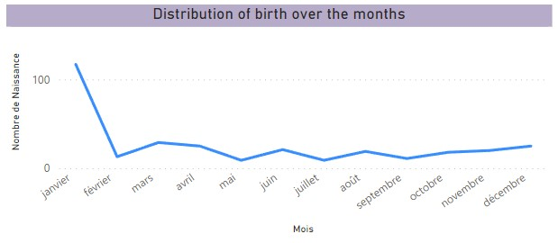
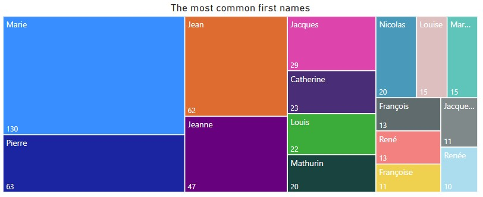

# Genealogy
**How is the population of a family tree distributed?**
>
The data is sourced from a CSV file containing information about individuals, such as their birth and death dates or names. After being cleaned in Python, the data can be visualized on Power BI using a dashboard.

Data visualization allowed us to observe, for example:
  -  The distribution of birth months over the years
      	
  -  The most common first names
        
  
